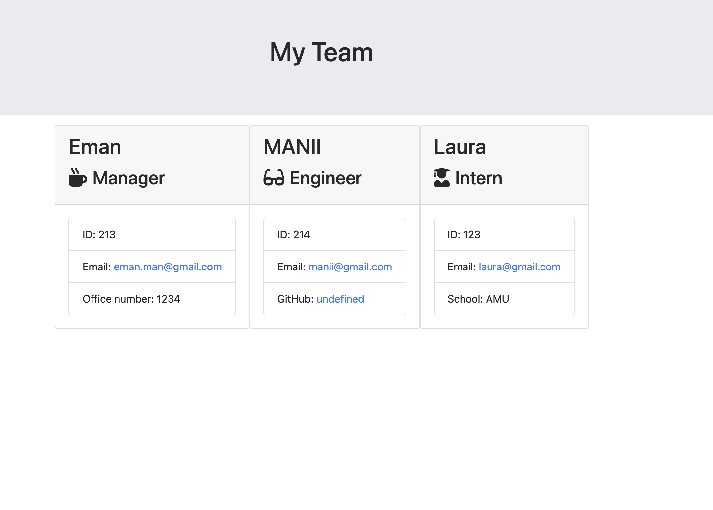

# Team-generator

This application will allow a manager
who want to generate a webpage that displays his or her team's basic info
so that  there's a quick access to emails and GitHub profiles. 

### Features

The goal is to build a software engineering team generator command line application.
Application needed to prompt the following:
1. information about the team manager 
2. information about the team engineer
3. information about the team intern

## Deployed Link 
* [YouTube Link](https://www.youtube.com/watch?v=lL0pku6OZ_0&feature=youtu.be)

## Screenshot of outcome

## Installation
npm install

### Technologies

* Bootstrap
* fontawesome

## Contributors
Emmanuel Stephen

GitHub: 